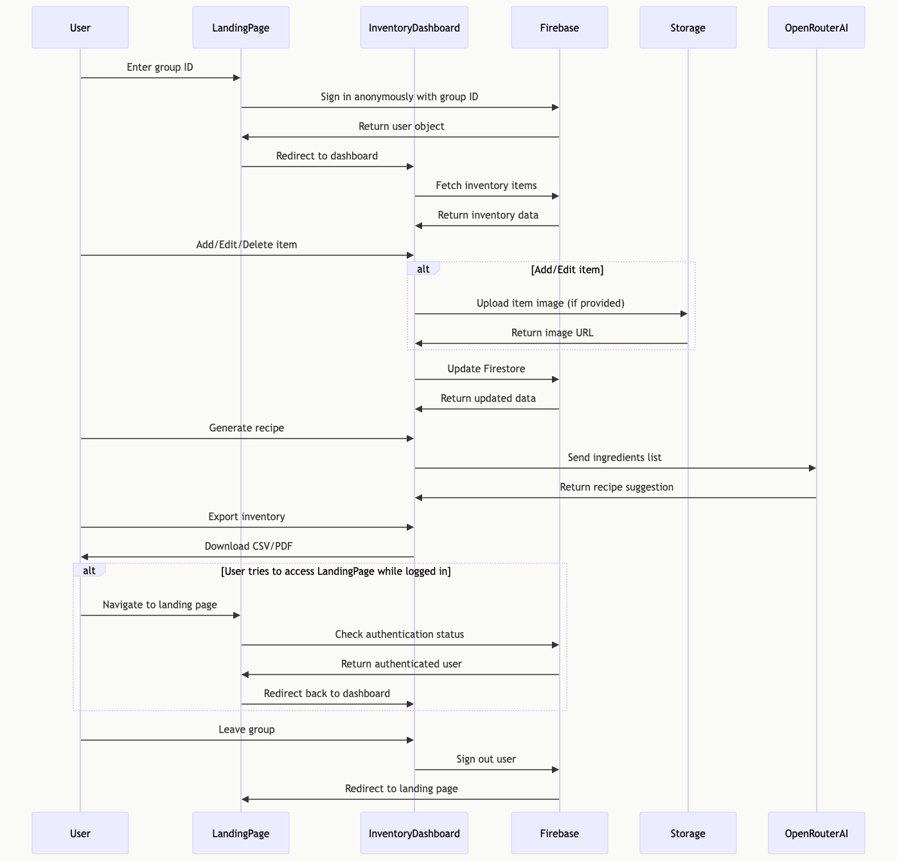
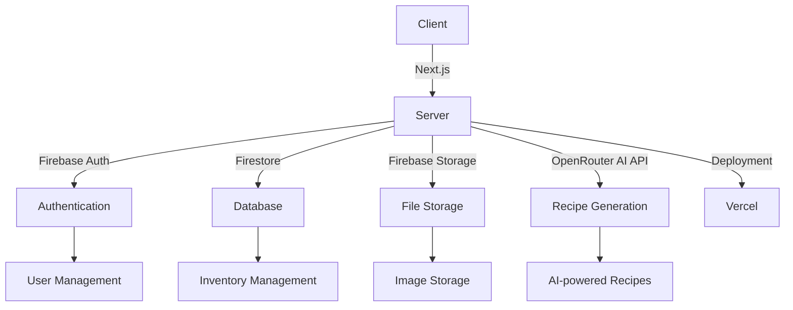

# Pantry Tracker

Pantry Tracker is a web application that helps users manage their pantry inventory, track items, and generate recipe ideas based on selected ingredients. The project implements a Next.js frontend with Material UI components, Firebase backend for data storage and querying functionality, and recipe suggestions using Meta's LLaMa 3.1 8B model through the Open Router API.  
Completed as "Project 2: Pantry Tracker" for 2024 Headstarter Fellowship.

Deployed at [pantry-tracker-joshuakojko.vercel.app](https://pantry-tracker-joshuakojko.vercel.app/)

## Key Features

- Real-time pantry management
- Item addition, editing, and deletion
- Image upload for items
- Search functionality
- Recipe generation using AI based on selected ingredients
- Export pantry ingredients to CSV or PDF
- Responsive design for mobile and desktop

## Tech Stack

- [Next.js](https://nextjs.org/)
- [React](https://reactjs.org/)
- [TypeScript](https://www.typescriptlang.org/)
- [Firebase](https://firebase.google.com/) (Authentication, Firestore, Storage)
- [Material-UI](https://mui.com/)
- [OpenRouter AI API](https://openrouter.ai/)
- [Vercel](https://vercel.com/) (Deployment)

## Running Locally

<details>
<summary>Click to expand</summary>

1. Clone the repository:
   ```
   git clone https://github.com/your-username/pantry-tracker.git
   ```

2. Navigate to the project directory:
   ```
   cd pantry-tracker
   ```

3. Install dependencies:
   ```
   npm install
   ```

4. Set up environment variables:
   Create a `.env.local` file in the root directory and add the following variables:
   ```
   NEXT_PUBLIC_FIREBASE_API_KEY=your_api_key
   NEXT_PUBLIC_FIREBASE_AUTH_DOMAIN=your_auth_domain
   NEXT_PUBLIC_FIREBASE_PROJECT_ID=your_project_id
   NEXT_PUBLIC_FIREBASE_STORAGE_BUCKET=your_storage_bucket
   NEXT_PUBLIC_FIREBASE_MESSAGING_SENDER_ID=your_messaging_sender_id
   NEXT_PUBLIC_FIREBASE_APP_ID=your_app_id
   NEXT_PUBLIC_OPENROUTER_API_KEY=your_openrouter_api_key
   ```

5. Set up Firebase:
   - Install Firebase CLI: `npm install -g firebase-tools`
   - Login to Firebase: `firebase login`
   - Initialize Firebase in your project: `firebase init`
   - Select Firestore and Storage when prompted
   - Deploy Firestore security rules: `firebase deploy --only firestore:rules`
   - Deploy Storage security rules: `firebase deploy --only storage:rules`

6. Run the development server:
   ```bash
   npm run dev
   ```

7. Open [http://localhost:3000](http://localhost:3000) in your browser.

</details>

## Usage

1. Create a new group or join an existing one on the login page.
2. Add items to your pantry by clicking the "Add New Item" button.
3. Edit or delete items as needed.
4. Use the search bar to find specific items.
5. Generate recipe ideas by selecting ingredients and clicking "Generate Recipe".
6. Export your inventory to CSV or PDF using the download options.

## Documentation

### Sequence Diagram


### Architecture Diagram


## OpenRouter AI Integration

This project uses [OpenRouter's Meta: LLaMa 3.1 8B Instruct (free) model](https://openrouter.ai/models/meta-llama/llama-3.1-8b-instruct%3Afree/api) for generating recipe suggestions. The API call is made to `https://openrouter.ai/api/v1/chat/completions` with the model specified as `meta-llama/llama-3.1-8b-instruct:free`.

## Acknowledgements

- Core functionalities were implemented following Headstarter Summer Engineer: Bill Zhang's Tutorial ["Building an Inventory Management App with Next.js, React, and Firebase"](https://medium.com/@billzhangsc/building-an-inventory-management-app-with-next-js-react-and-firebase-e9647a61eb82).
- The concept of Pantry Group Sessions was inspired by Headstarter Fellow Simon Xu's [Pantry Tracker](https://www.reddit.com/r/myHeadstarter/comments/1efiqm9/project_2_collaborative_pantry_tracker_simon_xu/). [GitHub Repository](https://github.com/simonxuuu/pantry-tracker), [Deployed on Vercel](https://pantry-tracker-simonxuuus-projects.vercel.app/).
- Login UI inspiration was drawn from Headstarter Fellow [Mayank Tamakuwala](https://www.reddit.com/r/myHeadstarter/comments/1eh2ngh/project_2_mayank_tamakuwala_difficulty_3/), [Deployed on Vercel](https://pantrymanagement.vercel.app/).
- Pantry UI inspiration was drawn from Headstarter Fellow [Danish Tiwari](https://www.reddit.com/r/myHeadstarter/comments/1ei8lzc/week_2_pantrypal_danish_tiwari_headstarter/).